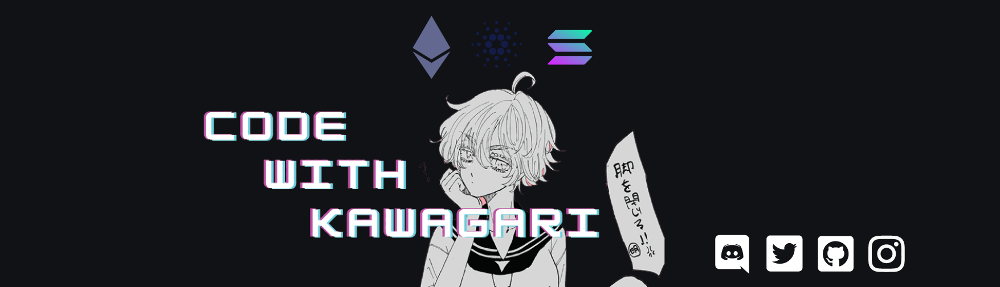

### Hi there! 🌌 

<h1>ikmxleo here or also known as CodeWithKawagari and icyurei 🧊</h1>

I'm currently working on a Web3 Dapps called LuneChain
 Also familiarising myself with Docker 🐳 
 If you like my work you can support me by purchasing my token LKY/BNB 🌙🗝️ on pancakeswap 0xa9cf3bee132af97249d2d1d8b85a2b03bb24ebc6 
 BTC 3QQRANfdTCGbskqCHToXeI 

<head>
  
  </head>

  

	

<!--
**4zer0day/4zer0day** is a ✨ _special_ ✨ repository because its `README.md` (this file) appears on your GitHub profile.

Here are some ideas to get you started:

- 🔭 I’m currently working on ...
- 🌱 I’m currently learning ...
- 👯 I’m looking to collaborate on ...
- 🤔 I’m looking for help with ...
- 💬 Ask me about ...
- 📫 How to reach me: ...
- 😄 Pronouns: ...
- ⚡ Fun fact: ...
449
641
-->
